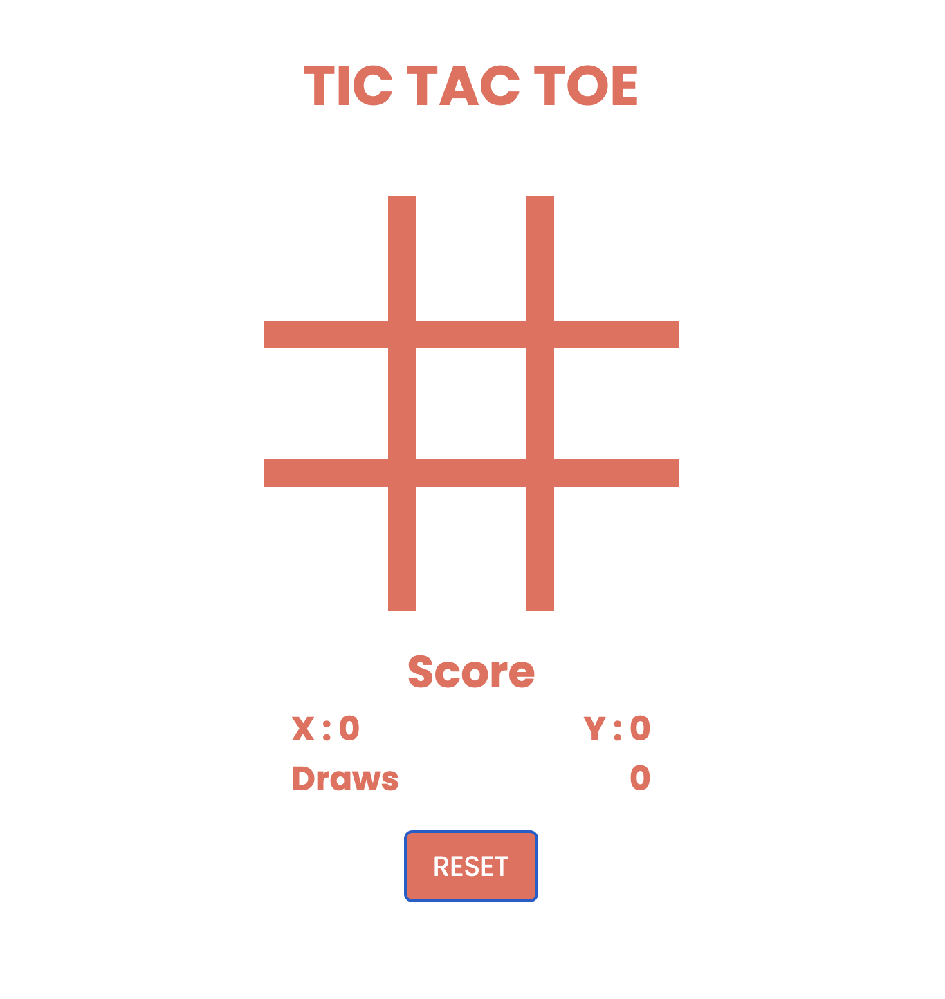

# tic-tac-toe

This is a simple Tic Tac Toe game implemented using HTML, CSS, and JavaScript. The game allows two players to take turns and compete against each other. It also includes a reset button to start a new game.

## Features

- Simple and intuitive user interface.
- Two-player mode.
- Responsive design for different screen sizes.
- Reset button to start a new game.

Enjoy the game!
